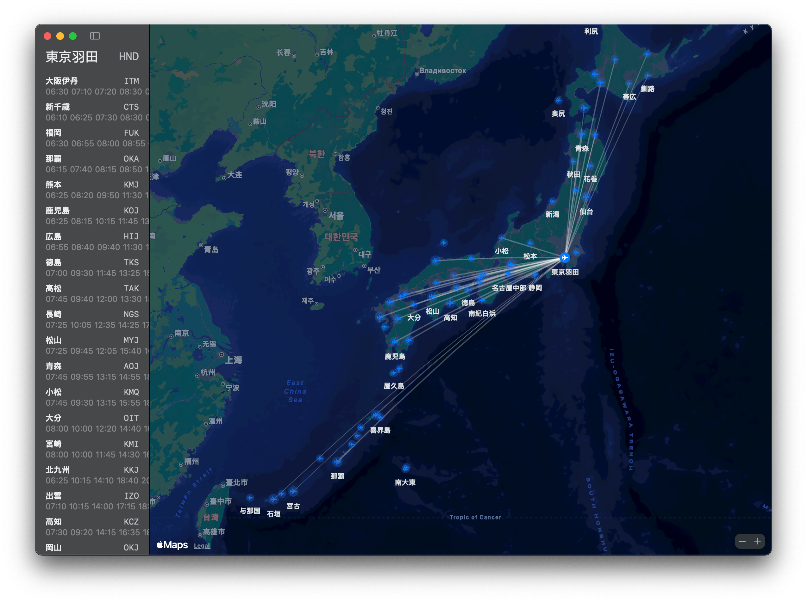

Calliandra
==========

Interactive flight route planner and connection map. Written as a SwiftUI desktop app exercise.

Build prerequisites
-------------------

`airports.json` and `flights.json` required for this app to work.

To use
------

Use the sidebar route planner to build a route from airport codes. Enter an airport code and press Return or click Add to append it to the route.

You can also click an airport on the map to open its detail popup, then use Add to Route to append that airport.

Route stops can be removed, reordered with drag and drop, or cleared. Airports may be revisited more than once, but each entered code must be a known airport in the static airport data.

The map shows the planned route, the airports already in the route, and known static connections from the final route stop. Segment mileage prefers authoritative static flight miles when matching flights are available, and falls back to a great-circle estimate when no static flight exists for that segment.

The sidebar shows departure times, durations, and mileage for available static flights to assist planning. Routes are not persisted after the app closes.

License
-------

© Poren Chiang 2025, released under [BSD-3 License](https://opensource.org/license/bsd-3-clause).
